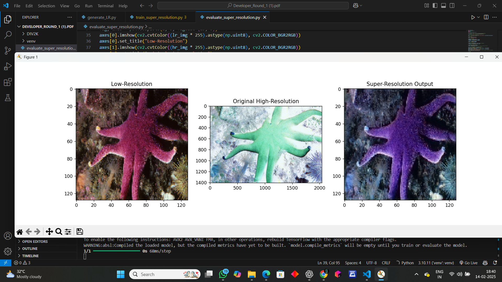

**The goal is to generate high-quality images from low-resolution inputs efficiently**

## data set 
 DIV-2K
Dataset for Super-Resolution

## About Dataset
DIV 2K
This is a dataset of hundreds of High Resolution images. I uploaded it for doing super resolution.

## Source
https://data.vision.ee.ethz.ch/cvl/DIV2K/
